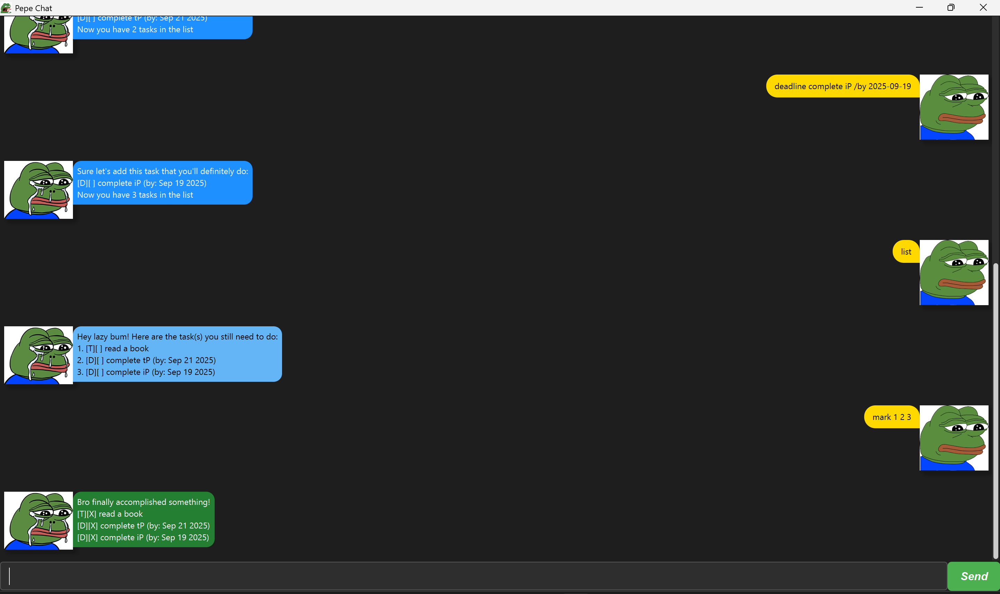

# Pepe - Task Tracking Assistant:

---


---
With Pepe constantly keeping track of your tasks, you will never have to waste time remembering them.
Pepe is a **lightweight desktop application** that provides users with commands that helps
to **boost efficiency**.

---

## Getting Started:
1. Download `pepe.jar` (*latest release*) from the [release page](https://github.com/clementsimwj/ip/releases)
2. Place it inside a folder (*as it will generate a file*)
3. Run the Application
4. Explore the [features](#features) Pepe offers
5. Refer [below](#troubleshooting) if needed

---

## Features:

---

> [!NOTE] <br>
> Command Format:
> - Words in ```UPPER_CASE``` are the parameters supplied to the user <br>
>   Example: ```todo TASK_NAME```, ```find TASK```
> - Extraneous parameters for commands without parameters will be ignored <br>
>   Example: ```list 123``` will be interpreted as ```list```
> - Any other commands not specified [below](#features) will be ignored <br>

---

| Feature           | Description                                                            | Command                                             | Example                                                             |
|-------------------|------------------------------------------------------------------------|-----------------------------------------------------|---------------------------------------------------------------------|
| View Tasks        | Shows a list of tasks (*from top to bottom*) beginning from index 1    | ```list```                                          | ```list```                                                          |
| Add To-Do Task    | Adds a regular To-Do task with no deadline                             | ```todo TASK_NAME```                                | ```todo Read a book```                                              |
| Add Deadline Task | Adds a Task with deadline                                              | ```deadline TASK_NAME /by DATE```                   | ```deadline Submit Assignment for CS2103T /by 2025-09-21```         |
| Add Event Task    | Adds a Task with both a Start Date and End Date                        | ```event TASK_NAME /from START_DATE /to END_DATE``` | ```event Recess Week for AY25/26 /from 2025-09-22 /to 2025-09-29``` |
| Mark Tasks        | Marks the specified task(s) with a ❌                                   | ```mark TASK_NUMBER```                              | ```mark 1``` <br> ```mark 1 3 5```                                  |
| Unmark Tasks      | Unmarks the specified task(s) by removing ❌                            | ```unmark TASK_NUMBER```                            | ```unmark 1``` <br> ```unmark 1 3 5```                              |
| Delete Tasks      | Deletes the specified task(s) from all tasks                           | ```delete TASK_NUMBER```                            | ```delete 1``` <br> ```delete 1 3 5```                              |
| Find Tasks        | Finds all task(s) (*returns a list*) that contain the specified keyword | ```find KEYWORD```                                  | ```find homework``` <br> ```find assignment```                      |
| Exit              | Saves task data and closes the app                                     | ```bye```                                           | ```bye```                                                           |

>[!IMPORTANT] <br>
> - ```TASK_NAME``` and ```KEYWORD``` is not space-sensitive
> - ```DATE```, ```START_DATE``` and ```END_DATE``` must be in the format <br> ***YYYY-MM-DD*** (Hyphens Included)
> - Each ```TASK_NUMBER``` has to be spaced apart

---

## Troubleshooting:

If you are still facing issues running Pepe, here are some possible solutions:

### Clone Repository:
1. Set up your local repository
2. Navigate to the *root* of your project
3. ```git clone https://github.com/clementsimwj/ip.git```
4. ```./gradlew run```
5. Alternatively, if you wish to have ```pepe.jar``` application installed, you can run the command ```./gradlew build```

### Create ```data``` folder:
1. Locate the folder containing ```pepe.jar```
2. Create a folder ```data```
3. Create a text-file ```tasks.txt```

>If your still face any problems, do contact me at e1397927@u.nus.edu

---

### "Your secrets are safe with me… mostly because I’m too lazy to remember." 🐸